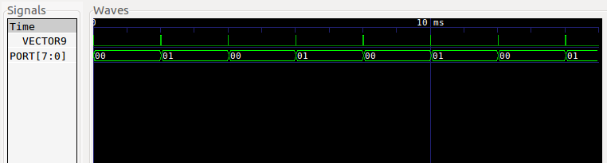
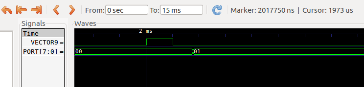
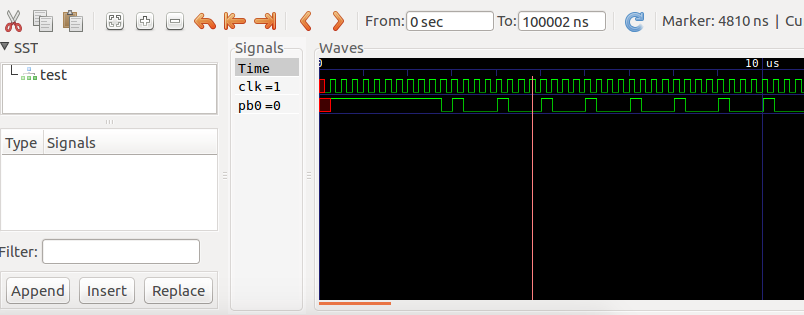
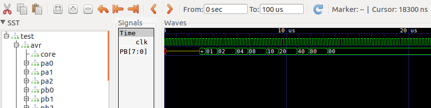
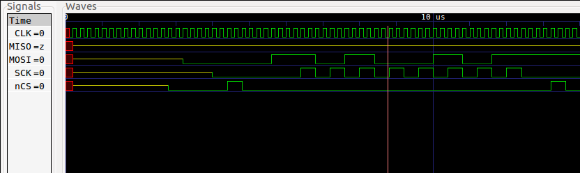
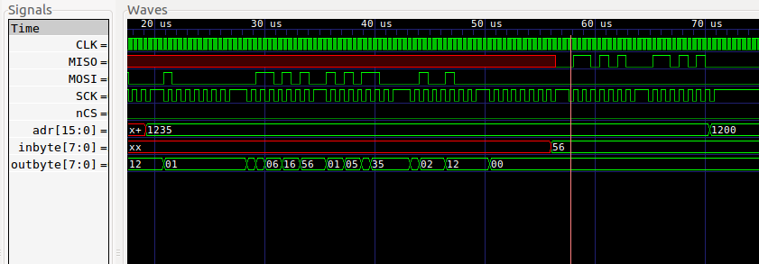
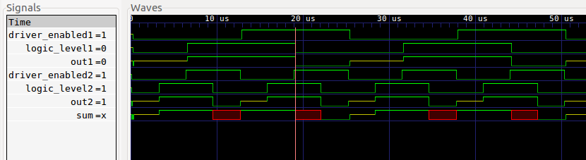

More examples
=============

Simulavr is designed to interact in a few different ways. These
examples briefly explain the examples that can be found in the source
distribution's ``examples`` directory.

Simple Example
--------------

This sample uses only simulavr to execute a hacked AVR program. I say
"hacked" because is shows using 3 simulator features that provide input,
output and simulation termination based on "magic" port access and
reaching a particular symbol.  It is only really useful for getting
your feet wet with simulavr, it is not a great example of how to use
simulavr. It is thought to be useful enough to the absolute newbie to
get you started though. See :ref:`here for a more detailed information <intro-simple-ex>`.

Go to ``examples/simple_ex1`` and build there the avr program::

  > avr-gcc -g -O2 -mmcu=at90s8515 -o fred.elf fred.c

After performing the build, run it. Notice the use of -W, -R and -T flags::

  > simulavr -d at90s8515 -f fred.elf -W 0x20,- -R 0x22,- -T exit

Then type something followed by :kbd:`ENTER`. Your typed string will be printed
out. For explanation of simulavr options see :ref:`usage <usage_chapter>`.

TCL Examples
------------

There are examples, which use Tcl/Tk. **For that you must also install Itcl
package for your Tcl.** It will be used in all examples with Tcl and a Tk GUI!
Over that you can find also examples for python interface and for the verilog
module.

The anacomp example is all we have started with. Anacomp brings up an
Itcl based GUI which shows two analog input simulations, a comparison
output value, and a toggle button on bottom. After changing the inputs,
hit the corresponding update to clock the simulation to respond to the
changed inputs.

The avr-gdb session for me requires a "load" before hitting "continue",
which actually starts the simulation.

It is strongly recommended to implement own simulation scripts very
closely to the examples. Usage of a different name than ``.x`` for
the grahic frame need changes of gui.tcl as well as some simulavr
sources. So stay better close to the example.

**To use the TCL examples you have to prepare 2 files in :file:`examples`
directory!**

In ``examples`` directory you can find 2 files: ``simulavr.tcl.sample``
and ``gui.tcl.sample`` Copy this files to ``simulavr.tcl`` and ``gui.tcl``
and edit the copied files.

**Edit simulavr.tcl:**

You need before 3 file paths, the path from tclsh tool, the path from wish
tool (both from the TCL/TK suite) and the path, where your TCL extention for
simulavr is installed. You can find out the paths for tclsh and wish with
the following commands::

  > which tclsh # prints out the path for tclsh, if found
  > which wish # prints out the path for wish, if found

Later you need also the ``ddd`` debugger graphical interface to avr-gdb::

  > which ddd # prints out the path for ddd, if found

For the path, where libsimulavr.so (the TCL extension) is installed, you have to
seek, where it's installed. This is system dependend! On debian systems and if you
have made the install with debian packages, it would be:
``/usr/lib/simulavr/libsimulavr.so``, that means, that you have to choose
``/usr/lib/simulavr``.

Then edit the beginning of file ``simulavr.tcl``:

.. code:: tcl

  #! @TCL_SHELL@
  # configuration area
  set WishCMD "@TCL_WISH@"
  set buildPrefix "@prefix@"
  # end configuration area

  #
  #  This demonstrates how to implement a custom Tcl "main" for the
  ...
  
Replace "@TCL_SHELL@" with the path for ``tclsh``, "@TCL_WISH@" with the path for
``wish`` and "@prefix@" with the path for ``libsimulavr.so``.

And the same for the beginnig of ``gui.tcl``:

.. code:: tcl

  #! @TCL_WISH@
  # configuration area
  set installPrefix "@prefix@"
  # end configuration area

  package require Itcl
  namespace import itcl::*
  ...

Now you're prepared to run the TCL examples.

TCL Anacomp Example
+++++++++++++++++++

.. note:: You must have installed the ITCL extension for TCL/TK to run this example!

This is Klaus' very nice original example simulation.

To build the avr program go to ``examples/anacomp`` directory::

  > avr-gcc -g -O2 -mmcu=at90s4433 -o main.elf main.c

After performing the build you can start the simulation::

  > ../simulavr.tcl -d at90s4433 -f main.elf -u -s anacomp.tcl

This starts a simple gui and enables the user to enter
analog values (0.0 .. 5.0) in the input fields. After entering a new
analog value in ain0 or ain1, you must press the update button!  

At this point, the output of the analog comparator will be used to
determine the output state of the "->B0" field. "->B0" displays
the state of the Port B 0 pin. Its value is determined by the
following logic:

* if ain0 >  ain1  B0 = H(igh)
* if ain0 == ain1  B0 = L(ow)
* if ain0 <  ain1  B0 = L(ow)

And not to forget, you can run this simulation together with gdb debugger or
also ddd::

  > tclsh ../simulavr.tcl -d at90s4433 -f main.elf -u -s anacomp.tcl -g

The one and only difference to the simulation command before is the
"-g" option!

LCD and SerialRx, SerialTx Example
++++++++++++++++++++++++++++++++++

.. note::

   You must have installed the ITCL extension for TCL/TK to and ddd to run
   this example!

This example is written by Knut Schwichtenberg and based on Klaus' Anacomp
Example and uses the avr-libc example stdiodemo to display characters on
the LCD.

.. image:: images/stdiodemo-setup.jpg

First we build the avr program. Go to ``examples/stdiodemo`` directory::

  > avr-gcc -g -mmcu=atmega128 -Os -Wall -DF_CPU=3686400UL \
      -o stdiodemo.elf hd44780.c lcd.c stdiodemo.c uart.c -lm

Then we have to prepare a tcl file too (in the same way as described before),
copy and edit checkdebug.tcl:

.. code:: tcl

  #! @TCL_WISH@
  # configuration area
  set WishCMD "@TCL_WISH@"
  set DDDCMD "@DDD@"
  set installPrefix "@prefix@"
  # end configuration area

  #
  ###############################################################################
  #
  # LCD and Serial IO example for simulavrxx
  ...
  
And now you can start::

  > wish ./checkdebug.tcl
  
The following commands are taken from the LCD-specific
``examples/stdiodemo/checkdebug.tcl`` script::

  Lcd mylcd $ui "lcd0" ".x"
  sc AddAsyncMember  mylcd

The first command creates a LCD instance ``mylcd`` with the name
``lcd0`` The second command adds the LCD instance to the simulavr
timer subsystem as an asynchronous member.  Asynchronous Timer objects
are updated every 1ns - which means every iteration in the simulavr
main-loop.  All timing is done internally in the ``lcd.c``. The
rest of this simulation script is the normal business create Nets for
each LCD pin, wire the Nets to the CPU pins.  The stdiodemo application
contains a serial receiver and transmitter part to receive commands and
interpret it and if possible prints it on the LCD or sends a response to
the serial receiver. Transmitter and receiver application are implemented
by polling opposite to the Keyboard example. The components used for
the SerialRx/Tx are described below. Together with the comments in the
script you should be able to understand what happens. Please mind the
different names for the functions SetBaudRate and GetPin for SerialRx
and SerialTx! Not optimal but that's it at the moment...

And you can try to simulate it with gdb or ddd::

  > tclsh ../simulavr.tcl -d atmega128 -f stdiodemo.elf -u -F 271 \
	    -s stdiodemo.tcl -g

Keyboard and SerialRx Example
+++++++++++++++++++++++++++++

.. note:: You must have installed the ITCL extension for TCL/TK to run this example!

This example is written by Knut Schwichtenberg and based on Klaus'
Anacomp Example and uses the Atmel application note AVR313 to convert
the incoming data from the keyboard into a serial ASCII stream and
sends this stream via the serial interface. Atmel's C-Code is ported
to a current avr-gcc (4.x) and a Mega128. For this example only the
serial transmitter is used. Atmel implemented the serial transmitter
as interrupt controlled application, opposite to the serial
transmitter / receiver of the LCD example. Here a polled solution is
implemented.

To build the avr program go to ``examples/atmel_key`` directory::

  > avr-gcc -g -mmcu=atmega128 -I. -DF_CPU=4000000UL -Os \
      -funsigned-char -funsigned-bitfields -fpack-struct \
      -fshort-enums -Wall -Wstrict-prototypes -o atmel_key.elf \
      kb.c main.c serial.c StdDefs.c -lm

After performing the build you can start the simulation::

  > ../simulavr.tcl -d atmega128 -f atmel_key.elf -u -F 250 \
      -s atmel_key.tcl

This example by itself is good to show how the GUI needs to be
setup to make the Keyboard component work. The output of the
keyboard is displayed into SerialRx component. Let's look into
the simulation script to point out some details:

**Keyboard:**

.. code:: tcl

  Keyboard kbd $ui "kbd1" ".x"
  Keyboard_SetClockFreq kbd 40000
  sc Add kbd

These three commands create a Keyboard instance ``kbd`` with
the name ``"kbd1"``. For this instance the clock timing is
set to 40000ns. simulavr internal timing for any asynchronous
activity are multiples of 1ns. The third command adds the keyboard
instance to the simulavr timer.

Create a CPU AtMega128 with 4MHz clock. Create indicators
for the digital pins (not necessary but good looking). Create a Net for
each signal - here Clock(key_clk), Data(key_data), Run-LED(key_runLED),
Test-Pin(key_TestPin), and Serial Output(key_txD0). Wire the pins
Net specific. Run-LED and Test-Pin are specific to the Atmel AP-Note
AVR313. The output of the keyboard converter is send to the serial
interface. Based on an "implementation speciality" of simulavr a serial
output must be either set by the AVR program to output or a Pin with a
Pull-Up activated has to be wired.

**SerialRx:**
  
.. code:: tcl

  SerialRx mysrx $ui "serialRx0" ".x"
  SerialRxBasic_SetBaudRate mysrx 19200

These two commands create a SerialRx instance ``mysrx`` with the name
``"serialRx0"``. For this instance the baud rate is set to 19200. This SerialRx
is wired to the controller pin, a display pin by the following commands:

.. code:: tcl

  ExtPin exttxD0 $Pin_PULLUP $ui "txD0" ".x"
  key_txD0 Add [AvrDevice_GetPin $dev1 "E1"]
  key_txD0 Add exttxD0
  key_txD0 Add [SerialRxBasic_GetPin mysrx "rx"]

The last command ExtPin shows an alternative default value for
txD0-Pin. Here it is pulled high - what is identical of adding any pull-up
resistor to the device pin - no matter which resistor value is used.

While creating this example, simulavr helped to find the bugs left in
the AP-Note.

atmega128_timer example
+++++++++++++++++++++++

This example uses Timer 2 on the ATMega128 to generate a periodic interrupt.
It prints 1 to 500 as the number of ticks increases. **It's not a dedicated
tcl example, but shows, that you can use :file:`simulavr.tcl` in the same way as
the original simulavr program.**

To build the avr program go to ``examples/atmega128_timer`` directory::

  > avr-gcc -g -mmcu=atmega128 -DF_CPU=4000000UL -Os \
      -o timer.elf main.c debugio.c

After performing the build you can start the simulation with simulavr::

  > simulavr -d atmega128 -f timer.elf -W 0x20,- -R 0x22,- -T exit

or with ``simulavr.tcl``:

  > tclsh ../simulavr.tcl -d atmega128 -f timer.elf -W 0x20,- -R 0x22,- -T exit

atmega48 example
++++++++++++++++

Demonstrates the ATMega48 and following Stimulation classes:

* HWAdmux - with additional pin inputs for not GPIO port support.
* SpiSink - monitors the /SS, SCLK and MISO pins and prints each byte
  to stdout.
* SpiSource - drives the /SS, SCLK and MOSI pins with data from the
  spidata file.
* PinMonitor - monitors Port A Bit 0 and prints changes in its binary
  status to stdout.
* AdcPin - Stimulates Port F Bit 0 with the values contained in the
  anadata{1,2,3} files.

The AVR program alternately (every other byte) echoes the byte received
on the SPI or the ADCH value read from a recenet A/D converter, to the SPI.
Also, the value from the A/D converter rotates through the values at
the pins PC5, ADC6, and ADC7.

The spidata file contains an HDLC encoded stream of *mostly* flags
that was used in my project at work. (We're running a form of
PPP/HDLC over SPI.)

The format of the spidata file consists of comments (lines
that start with a '#') and data lines. Each data line consists
of 3 values.

* First Value - the value (0 or non-zero)of /SS
* Second Value - the value (0 or non-zero) of SCLK
* Third Value - the value (0 or non-zero) of MOSI

When the SpiSource program stimulator reaches the end-of-file,
it rewinds and repeats ad-nauseum.

The anadata{1,2,3} files contains analog data that that is read by the
AdcPin class and written to the Port C Bit 5, ADC6 and ADC7 analog
inputs of the ATMega48.

The format of the anadata{1,2,3} files consists of comments (lines
that start with a '#' character) and analog input lines.
Each input line consists of 2 values separated by whitespace.

* First Value - number of nano-seconds before the next value
  is read and applied to the analog input.
* Second Value - signed integer "analogValue" to be applied
  to the analog input.

To try it:

Step 1:
  Build the AVR test program in ``examples/atmega48`` directory::

    > avr-gcc -g -mmcu=atmega48 -Os -o atmega48.elf main.cpp

Step 2:
  Prepare ``check.tcl`` in the same way as in other TCL examples before::
  
    #! @TCL_WISH@
    # configuration area
    set installPrefix "@prefix@"
    # end configuration area

    #load the avr-simulator package
    load ${installPrefix}/libsimulavr.so
    
  Replace the pathes for ``wish`` and the install path for libsimulavr.so
  
Step 3:
  Run the test TCL script from this directory::

    > wish check.tcl

Step 4:
  Marvel at the stdio activity.

Step 5:
  Try modifying the spidata file and see the results.

What you'll see on stdout::

  Note: Comments added on the right.

  spisink: /SS negated  ; SPI /SS goes HIGH (printed by SpiSink)
  spisink: /SS asserted ; SPI /SS goes LOW (printed by SpiSink)
  spisink: 0x7E         ; echoed HDLC Data from AVR on SPI MISO
  spisink: 0x66         ; Analog Data from AVR PC5 as decoded on SPI MISO
  spisink: 0x02         ; echoed HDLC Data from AVR on SPI MISO
  spisink: 0x33         ; Analog Data from AVR ADC6 as decoded on SPI MISO
  spisink: 0xD3         ; echoed HDLC Data from AVR on SPI MISO
  spisink: 0x28         ; Analog Data from AVR ADC7 as decoded on SPI MISO
  spisink: 0x7E         ; echoed HDLC Data from AVR on SPI MISO
  spisink: 0x23         ; Analog Data from AVR PC5 as decoded on SPI MISO
  ...
  ...
  spisink: 0x7E         ; echoed HDLC Data from AVR on SPI MISO
  spisink: 0x04         ; Analog Data from AVR {PC5,ADC6, ADC7} as decoded on SPI MISO
  PORTB0: NEGATE        ; Port B Bit 0 (interrupt output) set high by AVR (printed by PinMonitor)
  ...
  ...

feedback example
++++++++++++++++

This example illustrates how one can provide a program external to the
simulated AVR which provides "feedback" to the simulated program.  A
feedback program can interact with the AVR hosted program just like devices
would in the "real world." 

This example is certainly a primitive example of this but it illustrates
the principle.  The application writes the following lines to UART0::

  hello world #1
  hello world #2
  hello world #3
  hello world #1

The initial input value of ADC0 is 0.  When the feedback modules sees
1, 2 or 3, it changes the "voltage" on ADC0.  The debug output expected is::

  ADC0=10 expect 10
  ADC0=20 expect 20
  ADC0=30 expect 30
  ADC0=10 expect 10

To build the avr program go to ``examples/feedback`` directory::

  > avr-gcc -g -mmcu=atmega128 -DF_CPU=4000000UL -Os \
      -o feedback.elf main.c debugio.c uart.c adc.c

Prepare ``simfeedback.tcl`` in the same way as in other TCL examples before:

.. code:: tcl
  
  #!  @TCL_SHELL@

  package require Itcl
  namespace import itcl::*
    
Replace the path for ``tclsh``. If this is done, you can start the simulation
with ``simulavr.tcl``::

  > tclsh ../simulavr.tcl -d atmega128 -f feedback.elf -s feedback.tcl \
     -W 0x20,/dev/stderr -R 0x22,- -F 4000000 -T exit -S simfeedback.tcl

Python examples
---------------

This are some examples to demonstrate usage of pysimulavr. You need to build
python simulavr module named ``pysimulavr``. Maybe you have installed the
pysimulavr debian package, then you can test it::

  > python3
  >>> import pysimulavr
  >>>

If this works without a error message, then the python module is ready.

If not, e.g. you want to run the tests against the module, you have to build
just before, then you can give the environment variable PYTHONPATH with the
path to ``_pysimulavr.so`` and ``pysimulavr.py`` in the same line just before
the python command::

  > PYTHONPATH=<path-to-_pysimulavr.so> python3 <other-options>
  
All python examples are to find on ``examples/python`` directory. Go there and
try it:

Simple timer unittest
+++++++++++++++++++++

We have to build the avr program for the simulation::

  > avr-gcc -g -mmcu=atmega128 -O2 -o example.elf example.c

The program is a modified variant from tcl example atmega128_timer before. The
test is written as a unittest. You can start it by::

  > python3 example.py atmega128:example.elf

As result you should see something like this::

  test_01 (__main__.TestBaseClass)
  just run 3000 ns + 250 ns ... ok
  test_02 (__main__.TestBaseClass)
  just run 2 steps ... ok
  test_03 (__main__.TestBaseClass)
  check PC and PC size ... ok
  test_04 (__main__.TestBaseClass)
  check address of data symbols ... ok
  test_05 (__main__.TestBaseClass)
  access to data by symbol ... ok
  test_06 (__main__.TestBaseClass)
  write access to data by symbol ... ok
  test_07 (__main__.TestBaseClass)
  test toggle output pin ... ok
  test_08 (__main__.TestBaseClass)
  work with breakpoints ... ok

  ----------------------------------------------------------------------
  Ran 8 tests in 0.842s

  OK
    
So you can see, how easy it's to write unittests for simulavr or also for your
avr code. But you can use pysimulavr also for other things, look at example.py
how to use pysimulavr.

Connect pins and change state
+++++++++++++++++++++++++++++

Shows the usage of Pin and Net. A net connect pins together. Change the output
state of one pin will result in changing the input state of the other pins. This
can be used as starting point to understand usage of SetOutState/SetInState methods
of Pin class and how it works. This is not a real simulation. It demonstrates to
use Pin and Net class without a simulation target. You can start it by::

  > python3 example_pin.py

You see the following::

  set vcc=5.00V ...
  
  create 2 pins ...
    pin1: (char)pin='L', (bool)pin=0, pin.GetAnalogValue(vcc)=2.75V
    pin2: (char)pin='t', (bool)pin=1, pin.GetAnalogValue(vcc)=2.75V

  create net ...
    add pin1 to net:
  <pin1 change: in=L/0.00V, out=L/0.00V> 
    add pin2 to net:
  <pin1 change: in=L/0.00V, out=L/0.00V> <pin2 change: in=L/0.00V, out=t/0.00V> 
    pin1: (char)pin='L', (bool)pin=0, pin.GetAnalogValue(vcc)=0.00V
    pin2: (char)pin='t', (bool)pin=0, pin.GetAnalogValue(vcc)=0.00V

  set pin2 output to PULLUP:
  <pin1 change: in=L/0.00V, out=L/0.00V> <pin2 change: in=L/0.00V, out=h/0.00V> 
    pin1: (char)pin='L', (bool)pin=0, pin.GetAnalogValue(vcc)=0.00V
    pin2: (char)pin='h', (bool)pin=0, pin.GetAnalogValue(vcc)=0.00V

  set pin1 output to HIGH:
  <pin1 change: in=H/5.00V, out=H/5.00V> <pin2 change: in=H/5.00V, out=h/5.00V> 
    pin1: (char)pin='H', (bool)pin=1, pin.GetAnalogValue(vcc)=5.00V
    pin2: (char)pin='h', (bool)pin=1, pin.GetAnalogValue(vcc)=5.00V

  set pin2 output to TRISTATE:
  <pin1 change: in=H/5.00V, out=H/5.00V> <pin2 change: in=H/5.00V, out=t/5.00V> 
    pin1: (char)pin='H', (bool)pin=1, pin.GetAnalogValue(vcc)=5.00V
    pin2: (char)pin='t', (bool)pin=1, pin.GetAnalogValue(vcc)=5.00V

  set pin1 output to TRISTATE:
  <pin1 change: in=t/2.75V, out=t/2.75V> <pin2 change: in=t/2.75V, out=t/2.75V> 
    pin1: (char)pin='t', (bool)pin=1, pin.GetAnalogValue(vcc)=2.75V
    pin2: (char)pin='t', (bool)pin=1, pin.GetAnalogValue(vcc)=2.75V

  set pin2 output to LOW:
  <pin1 change: in=L/0.00V, out=t/0.00V> <pin2 change: in=L/0.00V, out=L/0.00V> 
    pin1: (char)pin='t', (bool)pin=0, pin.GetAnalogValue(vcc)=0.00V
    pin2: (char)pin='L', (bool)pin=0, pin.GetAnalogValue(vcc)=0.00V

How to control pins
+++++++++++++++++++

This is a more complex example. It demonstrates, how you can simply watch for
pin output changes and how you could inject external pin changes to the simulator
to stimulate your program functionality. We build at first the avr program for
the simulation::

  > avr-gcc -g -mmcu=atmega128 -O2 -o example_io.elf example_io.c

The program is a modified variant from tcl example atmega128_timer before.

In this simulation we have a external connection to pin A0, A1 and A7 from port A
and set the state of pin A1 and A7 to low or high at a defined simulation time. And
we can see, when and how the state of this pin is changed.

You can start the simulation by::

  > python3 example_io.py atmega128:example_io.elf

As result you should see something like this::

  simulation start: (t=0µs)
  simulation end: (t=15000µs)
  pin A0
    change to 't' at 0µs (dt=0µs)
    change to 'L' at 17µs (dt=17µs)
    change to 'H' at 2032µs (dt=2015µs)
    change to 'L' at 4032µs (dt=2000µs)
    change to 'H' at 6036µs (dt=2005µs)
    change to 'L' at 8035µs (dt=1999µs)
    change to 'H' at 10034µs (dt=1999µs)
    change to 'L' at 12033µs (dt=1999µs)
    change to 'H' at 14037µs (dt=2004µs)
  pin A1
    change to 'H' at 0µs (dt=0µs)
    change to 'L' at 7000µs (dt=7000µs)
    change to 'H' at 14000µs (dt=7000µs)
  pin A7
    change to 'H' at 0µs (dt=0µs)
    change to 'L' at 12000µs (dt=12000µs)
  value 'timer2_ticks'=7
  value 'port_val'=0x7e
  value 'port_cnt'=3
  
How to get a more detailed view
+++++++++++++++++++++++++++++++

This example is closed to the example before. ex_pinout.c initialise timer2 in
CTC mode for a period of 2ms on 4MHz clock frequency. Example output shows the
toggle of pin A0. But we will also write a VCD dump. If you have installed
``gtkwave`` you can open this VCD dump file ``ex_pinout.vcd`` with ``gtkwave``.
So you can compare time written out by this example with the results shown in
``gtkwave``. The signal IRQ.VECTOR9 in VCD dump shows when and how long the ISR
was running! First build the avr program::

  > avr-gcc -g -mmcu=atmega128 -O2 -o ex_pinout.elf ex_pinout.c

Then start it by::

  > python3 ex_pinout.py atmega128:ex_pinout.elf

Output is::

  port A.0 set to 't' (t=0ns)
  port A.0 set to 't' (t=0ns)
  simulation start: (t=0ns)
  port A.0 set to 'L' (t=10750ns)
  port A.0 set to 'L' (t=11000ns)
  port A.0 set to 'H' (t=2017750ns)
  port A.0 set to 'L' (t=4018000ns)
  port A.0 set to 'H' (t=6018500ns)
  port A.0 set to 'L' (t=8015750ns)
  port A.0 set to 'H' (t=10016250ns)
  port A.0 set to 'L' (t=12016500ns)
  port A.0 set to 'H' (t=14017000ns)
  simulation end: (t=15000000ns)
  value 'timer2_ticks'=7

And now (if you have installed ``gtkwave``) you can view the traced waveforms::

  > gtkwave -a ex_pinout.sav ex_pinout.vcd

The full view:

Let's look on a detail. You can see, how long the interrupt procedure was running and
when the port value was changed. Compare it with the print out on standard out before!
(in picture the value for "Marker:")

Multicore example
+++++++++++++++++

This example demonstrates using python interface for multicore simulation. We
simulate 2 ATmega16 cores::

  +----------+             +----------+
  | Core A   | PB3     PD2 | Core B   |
  | 4MHz     |------>------| 10MHz    |
  |          |             |          |
  +----------+             +----------+
  
Core A runs as a 250Hz clock generator on pin B3. B3 from core A is conected with
pin D2 on core B. Core B counts now all rising edges on pin D2 and measures the
time distance between 2 events with timer T0.

This example shows:

- how to use python interface
- how it is possible to run a multicore simulation, in this example also with
  different clock sources for the cores
- how to connect pins between cores
- how to access global variables, how to get address for a global variable and
  how to read RAM values from a address
  
Build the 2 avr programs::

  > avr-gcc -g -mmcu=atmega16 -O2 -DDUAL_A=1 -o multicore_a.elf multicore.c
  > avr-gcc -g -mmcu=atmega16 -O2 -DDUAL_B=1 -o multicore_b.elf multicore.c

And run the simulation::

  > python3 multicore.py

Resulting output should then look like::

  multicore example:
    create core A ...
    create core B ...
    connect core A with core B ...
    core B: address(cnt_irq)=0x61
    core B: address(cnt_res)=0x61
    run simulation ...
    t= 4ms, cnt_irq=1, cnt_res= 78
    t= 8ms, cnt_irq=2, cnt_res=156
    t=20ms, cnt_irq=5, cnt_res=157
    t=32ms, cnt_irq=8, cnt_res=156

ADC example
+++++++++++

A example to simulate analog input and how to simulate adc conversion. Build
avr program and run the simulation::

  > avr-gcc -g -mmcu=atmega16 -O2 -o adc.elf adc.c
  > python3 adc.py atmega16:adc.elf

The output shows::

  before simulation start:
    value 'adc_value'=43690 (before init)
    aref set to 2.5V
    a0 set to 0.3V, this will expect an converted adc int value=122
  simulation start: (t=0ns)
  run till main function ...
  simulation main entrance: (t=24250ns)
    value 'adc_value'=5555 (after init)
  simulation break: (t=144250ns)
    value 'conversions'=1
    value 'adc_value'=122 (simulation break)
  simulation end: (t=474250ns)
    value 'conversions'=6
    value 'adc_value'=122 (simulation end)

Verilog examples
----------------

To use this examples you have to build simulavr together with the verilog extension.
See :ref:`here how to make it <build_chapter>`. You can find the example files
in ``examples/verilog`` directory. Further, if you want to see the waveform you need
the ``gtkwave`` program. It's a program to display digital waveforms.

baretest example
++++++++++++++++

First compile and link avr program::

  > avr-gcc -mmcu=at90s4433 -Os -o toggle.elf toggle.c
  
Then compile and run the verilog source file::

  > iverilog baretest.v -s test -v avr.v -o baretest.vvp 
  > vvp -M<path-to-avr.vpi-directory> -mavr baretest.vvp

Replace <path-to-avr.vpi-directory> to the directory, where your ``avr.vpi`` is situated.
(could be, for example, in ``<root-of-repository>/build/libsim``) This will create a file
``baretest.vcd``. And if you now start ``gtkwave``, you can see the result::

  > gtkwave -a baretest.sav baretest.vcd
  
**What this example do?**

This is the code:

.. code-block:: c

  int main() {
    DDRB = 1;
    while(1) {
	  PORTB = 1;
	  PORTB = 0;
    }
  }

It sets port B pin 0 to output and start a endless loop toggeling pin 0 at port B. And the
result is:

loop example
++++++++++++

Steps are the same as before for baretest example::

  > avr-gcc -mmcu=attiny2313 -Os -o loop.elf loop.c
  > iverilog loop.v -s test -v avr.v avr_ATtiny2313.v -o loop.vvp 
  > vvp -M<path-to-avr.vpi-directory> -mavr loop.vvp
  
The code is similar to toggle.c but with a twist:

.. code-block:: c

  int main() {
    DDRB = 0xff;
    PORTB = 1;
    while(1) {
	  PORTB = PINB << 1;
    }
  }

Lets see the result::

  > gtkwave -a loop.sav loop.vcd

spi waveform examples
+++++++++++++++++++++

A more complicated example: send data via spi::

  > avr-gcc -mmcu=atmega8 -Os -o spi-waveforms.elf spi-waveforms.c
  > iverilog spi-waveforms.v -s test -v avr.v avr_ATmega8.v -o spi-waveforms.vvp 
  > vvp -M<path-to-avr.vpi-directory> -mavr spi-waveforms.vvp
  > gtkwave -a spi-waveforms.sav spi-waveforms.vcd

And we can see the spi signals (just the first byte sequence) in gtkwave:

And a second example where data will be send out from controller and received
by controller::

  > avr-gcc -mmcu=atmega8 -Os -o spi.elf spi.c
  > iverilog spi.v -s test -v avr.v avr_ATmega8.v -o spi.vvp 
  > vvp -M<path-to-avr.vpi-directory> -mavr spi.vvp
  > gtkwave -a spi.sav spi.vcd

And the simulation result:

vst example
+++++++++++

The example shows how two cores can be instantiated. Both cores are driven
with different clocks::

  > avr-gcc -mmcu=atmega32 -Os -o vst.elf vst.cpp
  > iverilog vst.v -s test -v avr.v avr_ATmega32.v -o vst.vvp 
  > vvp -M<path-to-avr.vpi-directory> -mavr vst.vvp
  > gtkwave -a vst.sav vst.vcd

There is a wire "out" which is connected to pins of both devices.

What the graph shows:

``driver_enabledX`` (X is 1 or 2 for core 1 or core 2) shows the pin from the port
driven by coreX - this represents DDR bit. ``logic_levelX`` represents the setting
of PORT bit. ``outX`` represents the resulting signal from above values.

Because there are 2 devices driving the ``sum`` wire, we get the following results:

* if both core have the driver disabled and none has pull up enabled, the result
  is "x"
* if only one core has the driver enabled, the wire ``sum`` is the value of "out" of
  the driver.
* if two cores have the driver enabled and both "out" signals are the same, ``sum``
  shows the same level as "out".
* if both cores drive the signal but with different level, the result on ``sum`` is "x"
  (short circuit!)

If the avr reads from the pins ( mirrored in the signals mirrorX ) the read value
is "1" if the wire is in "1", "z" or "x"! There is no definition of "z" or "x" so we simply
use "1". A logic "0" is read as "0".

spc example
+++++++++++

A last verilog example show also the use of 2 cores with 2 different device types and
also different clocks::

  > # create right-unit.elf
  > avr-gcc -c -Wa,-gstabs -x assembler-with-cpp -o right-unit.o right-unit.s
  > avr-gcc -c -Wa,-gstabs -x assembler-with-cpp -o singlepincomm.o singmepincomm.s
  > avr-ld -e _start -o right-unit.elf right-unit.o singlepincomm.o
  > # create left-unit.elf
  > avr-gcc -mmcu=attiny2313 -Os -o left-unit.elf left-unit.c csinglepincomm.c
  > # compile verilog source and run it
  > iverilog spc.v -s test -v avr.v avr_ATtiny2313.v avr_ATtiny25.v -o spc.vvp
  > vvp -M<path-to-avr.vpi-directory> -mavr spc.vvp
  > # show result
  > #gtkwave -a spc.sav spc.vcd
